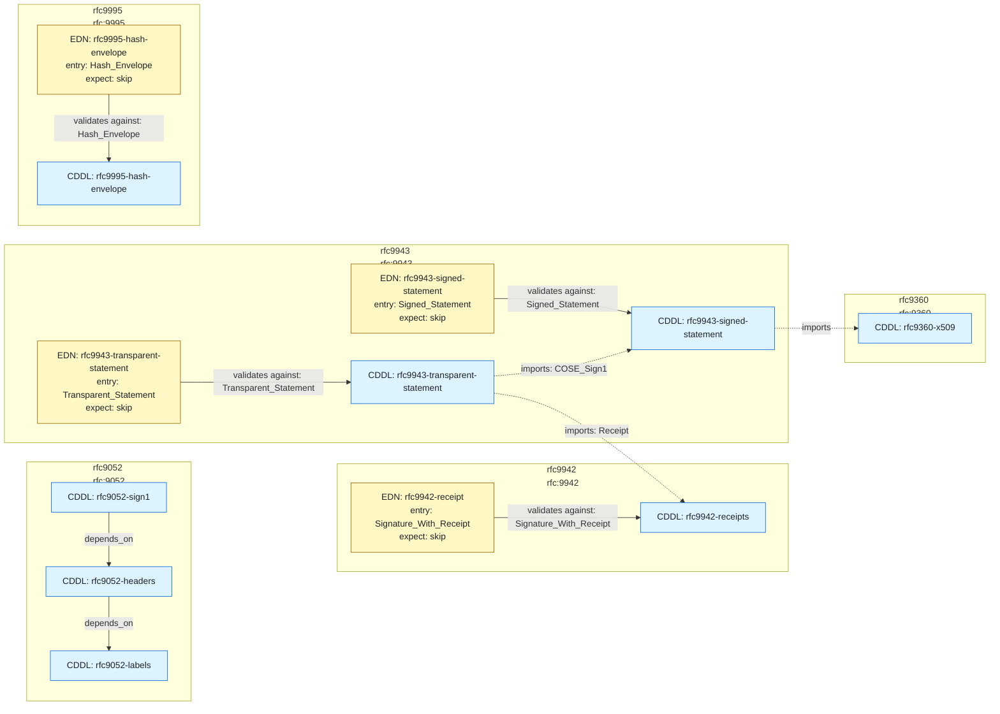

<!-- Generated by cddl-map diagram --markdown; do not edit. -->

```mermaid
flowchart LR
  subgraph document_1["rfc9052<br/>rfc:9052"]
    direction TB
    cddl_1["CDDL: rfc9052-labels"]
    cddl_2["CDDL: rfc9052-headers"]
    cddl_3["CDDL: rfc9052-sign1"]
  end
  subgraph document_2["rfc9360<br/>rfc:9360"]
    direction TB
    cddl_4["CDDL: rfc9360-x509"]
  end
  subgraph document_3["rfc9942<br/>rfc:9942"]
    direction TB
    cddl_5["CDDL: rfc9942-receipts"]
    edn_1["EDN: rfc9942-receipt<br/>entry: Signature_With_Receipt<br/>expect: skip"]
  end
  subgraph document_4["rfc9943<br/>rfc:9943"]
    direction TB
    cddl_6["CDDL: rfc9943-signed-statement"]
    cddl_7["CDDL: rfc9943-transparent-statement"]
    edn_2["EDN: rfc9943-signed-statement<br/>entry: Signed_Statement<br/>expect: skip"]
    edn_3["EDN: rfc9943-transparent-statement<br/>entry: Transparent_Statement<br/>expect: skip"]
  end
  subgraph document_5["rfc9995<br/>rfc:9995"]
    direction TB
    cddl_8["CDDL: rfc9995-hash-envelope"]
    edn_4["EDN: rfc9995-hash-envelope<br/>entry: Hash_Envelope<br/>expect: skip"]
  end

  cddl_2 -->|"depends_on"| cddl_1
  cddl_3 -->|"depends_on"| cddl_2
  cddl_6 -.->|"imports"| cddl_4
  cddl_7 -.->|"imports: COSE_Sign1"| cddl_6
  cddl_7 -.->|"imports: Receipt"| cddl_5
  edn_1 -->|"validates against: Signature_With_Receipt"| cddl_5
  edn_2 -->|"validates against: Signed_Statement"| cddl_6
  edn_3 -->|"validates against: Transparent_Statement"| cddl_7
  edn_4 -->|"validates against: Hash_Envelope"| cddl_8

  classDef cddl fill:#ddf4ff,stroke:#0969da,color:#1f2328;
  classDef accepted fill:#dafbe1,stroke:#1a7f37,color:#1f2328;
  classDef rejected fill:#ffebe9,stroke:#cf222e,color:#1f2328;
  classDef skipped fill:#fff8c5,stroke:#9a6700,color:#1f2328;
  class cddl_1,cddl_2,cddl_3,cddl_4,cddl_5,cddl_6,cddl_7,cddl_8 cddl;
  class edn_1,edn_2,edn_3,edn_4 skipped;
```
